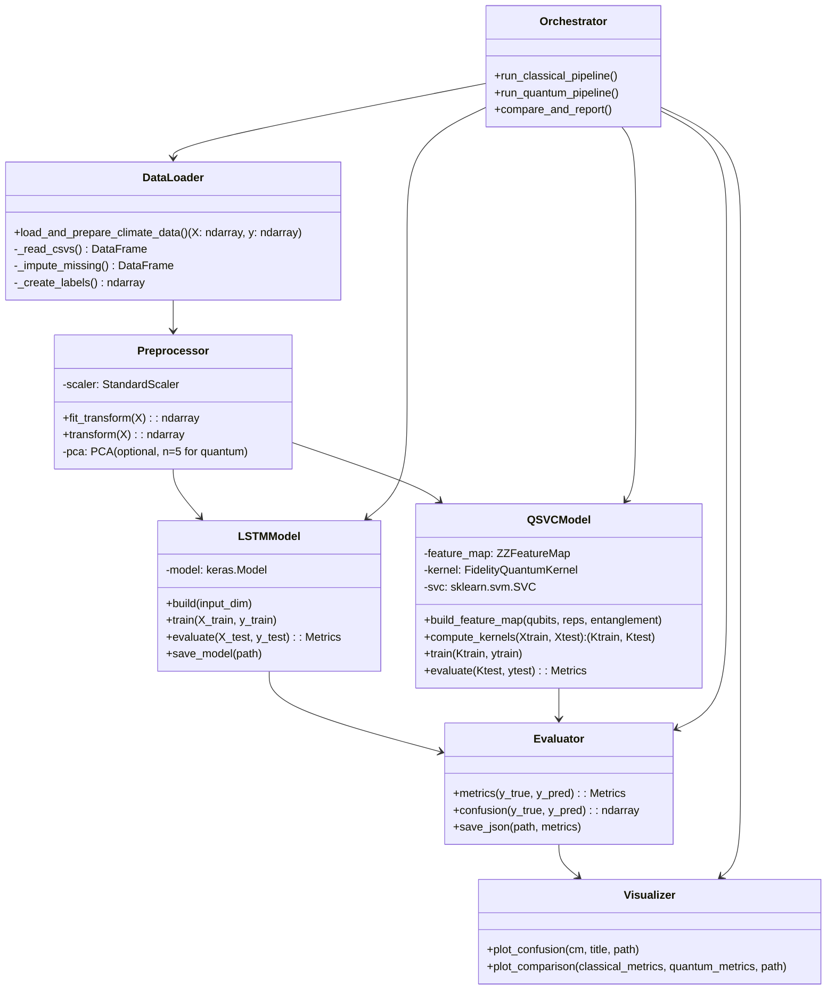

# Chapter 4: Detailed Design

This chapter details the design of the "Quantum vs Classical Machine Learning for Climate Prediction" system, aligned with your implemented codebase and results.

- Data source: 157 RSCHR radar CSVs → 323,280 samples, 35 features
- Classical model: LSTM (27,713 params), 99.74% accuracy
- Quantum model: QSVC (5 qubits, ZZFeatureMap), 78.60% accuracy
- Key files: `load_climate_data.py`, `classical_lstm_model.py`, `quantum_qsvc_optimized.py`, `compare_models.py`, `run_all_models.py`

---

## 4.1 System Architecture

High-level component view capturing the end-to-end workflow and responsibilities.

- Data Layer: Ingests and validates CSVs, extracts 35 features, derives labels (`DBZ_max > 30 dBZ`).
- Preprocessing Layer: Standardization (all models), PCA (quantum path only; 35 → 5 components).
- Model Layer:
  - Classical path: LSTM → binary classification.
  - Quantum path: QSVC using a 5-qubit ZZFeatureMap + FidelityQuantumKernel + SVC (precomputed).
- Evaluation Layer: Computes Accuracy, Precision, Recall, F1, Confusion Matrix; persists results.
- Visualization Layer: Per-model figures + comparative chart.
- Orchestration Layer: Runs pipelines and produces `FINAL_RESULTS.md` and `RESEARCH_PAPER.md`.

```mermaid
flowchart LR
  A[Data: 157 CSV files] --> B[load_climate_data.py<br/>X(323,280x35), y(323,280)]
  B --> C1[Preprocess (Classical)<br/>StandardScaler (35)]
  B --> C2[Preprocess (Quantum)<br/>StandardScaler → PCA(5)]
  C1 --> D1[LSTM Model<br/>classical_lstm_model.py]
  C2 --> D2[QSVC + Quantum Kernel<br/>quantum_qsvc_optimized.py]
  D1 --> E1[Metrics + Plots<br/>classical_results.json/png]
  D2 --> E2[Metrics + Plots<br/>quantum_results.json/png]
  E1 & E2 --> F[compare_models.py<br/>model_comparison_complete.png]
  F --> G[FINAL_RESULTS.md / RESEARCH_PAPER.md]
```

---

## 4.2 System Design

### 4.2.1 Modules and Responsibilities
- `load_climate_data.py`
  - Load 157 CSVs, concatenate to DataFrame (323,280 rows, 41 columns)
  - Select 35 meteorological features; impute missing values with column means
  - Create labels: extreme weather if `DBZ_max > 30 dBZ`
- `classical_lstm_model.py`
  - Standardize features; train/test split (80/20, stratified)
  - LSTM(64) → Dropout(0.2) → Dense(32, ReLU) → Dropout(0.2) → Dense(1, Sigmoid)
  - Train with Adam + BCE, early stopping; evaluate; save model and metrics/plots
- `quantum_qsvc_optimized.py`
  - Standardize → PCA(n_components=5) → Quantum feature map (ZZFeatureMap, reps=2, full entanglement)
  - Compute FidelityQuantumKernel (train/test kernels)
  - Train SVC(kernel='precomputed', C=10.0, class_weight='balanced); evaluate; save metrics/plots
- `compare_models.py`
  - Load JSONs; produce side-by-side comparison figure and summary
- `run_all_models.py`
  - Orchestrate full experiment runs (if used)

### 4.2.2 Data Contracts
- Input features `X`: `np.ndarray` shape (N, 35); labels `y`: `np.ndarray` shape (N,), values {0,1}
- Classical path: `X_train`/`X_test` shape (m, 35)/(n, 35)
- Quantum path: `X_pca_train`/`X_pca_test` shape (1000, 5)/(500, 5)
- Quantum kernels: `K_train` shape (1000, 1000); `K_test` shape (500, 1000)
- Metrics persisted to JSON with keys: accuracy, precision, recall, f1_score, timings

### 4.2.3 Key Algorithms
- Standardization: `StandardScaler` per feature (zero mean, unit variance)
- PCA: `n_components=5` for quantum (≈0.68 explained variance)
- Quantum Feature Map: `ZZFeatureMap(feature_dimension=5, reps=2, entanglement='full')`
- Quantum Kernel: Fidelity kernel `K(x_i, x_j) = |⟨φ(x_i)|φ(x_j)⟩|^2` via Aer statevector simulator
- Classical Classifier: SVC with precomputed kernel (quantum path); LSTM (classical path)

### 4.2.4 Hyperparameters and Configurations
- LSTM: units=64, dense=32, dropout=0.2, batch=20, max_epochs=50 (early stop ≈15), lr=0.001
- QSVC: qubits=5, reps=2, entanglement='full', C=10.0, class_weight='balanced', train=1000, test=500
- Sampling: stratified; maintain natural distribution (~87% normal, ~13% extreme)

### 4.2.5 Error Handling, Logging, and Reproducibility
- Imputation logs total missing values and fills by column mean
- Verifies class distribution and sufficient minority samples; stratified splits
- Fixed seeds where applicable (e.g., `random_state=42` for splits) for reproducibility
- Exceptions surface with informative messages; outputs written atomically

### 4.2.6 Outputs and Artifacts
- JSON: `classical_results.json`, `quantum_results.json`
- Figures: `classical_lstm_results.png`, `quantum_qsvc_results.png`, `model_comparison_complete.png`
- Models: `lstm_model.h5`; transformers: `scaler.pkl`
- Reports: `FINAL_RESULTS.md`, `RESEARCH_PAPER.md`

---

## 4.3 Activity Diagram

```mermaid
flowchart TD
  start([Start]) --> load[Load CSVs\nload_climate_data.py]
  load --> preprocess[Impute Missing + Standardize]
  preprocess --> split[Train/Test Split (Stratified 80/20)]
  split --> branch{Model Path?}
  branch -->|Classical| lstm_prep[Use 35 Features]
  branch -->|Quantum| q_prep[Apply PCA → 5 Features]
  lstm_prep --> lstm_train[Train LSTM]
  q_prep --> q_kernel[Build ZZFeatureMap + Compute Quantum Kernels]
  lstm_train --> lstm_eval[Evaluate LSTM\nSave JSON/PNG]
  q_kernel --> qsvc_train[Train SVC (precomputed kernel)]
  qsvc_train --> q_eval[Evaluate QSVC\nSave JSON/PNG]
  lstm_eval --> compare[Compare Results\ncompare_models.py]
  q_eval --> compare
  compare --> report[Generate\nFINAL_RESULTS.md / RESEARCH_PAPER.md]
  report --> end([End])
```

---

## 4.4 Use Case Diagram

```mermaid
usecaseDiagram
actor Researcher as R
actor "System Admin" as SA

rectangle System {
  usecase UC1 as "Load & Preprocess Data"
  usecase UC2 as "Train Classical LSTM"
  usecase UC3 as "Train Quantum QSVC"
  usecase UC4 as "Evaluate & Save Metrics"
  usecase UC5 as "Visualize Results"
  usecase UC6 as "Compare Models"
  usecase UC7 as "Export Reports"
  usecase UC8 as "Configure Hyperparameters"
}

R --> UC1
R --> UC2
R --> UC3
R --> UC4
R --> UC5
R --> UC6
R --> UC7
R --> UC8

SA --> UC1
SA --> UC8
```

---

## 4.5 Class Diagram

Logical view of key components (mapped to your modules):



---

## 4.6 Sequence Diagram

Quantum QSVC pipeline execution:

```mermaid
sequenceDiagram
participant R as Researcher
participant O as Orchestrator
participant DL as DataLoader
participant PP as Preprocessor
participant QM as QSVCModel
participant EV as Evaluator
participant VZ as Visualizer

R->>O: run_quantum_pipeline()
O->>DL: load_and_prepare_climate_data()
DL-->>O: X(323,280x35), y
O->>PP: fit_transform(StandardScaler)
PP-->>O: X_scaled
O->>O: train_test_split (stratified)
O->>PP: fit PCA(5) on train; transform test
PP-->>O: X_pca_train(1000x5), X_pca_test(500x5)
O->>QM: build_feature_map(5q, 2 reps, full)
QM-->>O: feature_map ready
O->>QM: compute_kernels(train, test)
QM-->>O: K_train(1000x1000), K_test(500x1000)
O->>QM: train SVC(C=10, balanced)
QM-->>O: model trained
O->>QM: predict(K_test)
QM-->>O: y_pred
O->>EV: metrics(y_test, y_pred)
EV-->>O: acc, prec, rec, f1, cm
O->>VZ: plot_confusion(cm); save JSON/PNG
VZ-->>O: artifacts written
O-->>R: quantum_results.json/png
```

---

## 4.7 Data Flow Diagram

Process, stores, and outputs across both model paths:

```mermaid
flowchart LR
  subgraph Sources
    S1[CSV Files\nRSCHR_*_L2B_STD.csv]
  end

  subgraph Processing
    P1[Load & Combine\nload_climate_data.py]
    P2[Impute Missing\nColumn Means]
    P3[Normalize\nStandardScaler]
    P4A[PCA (Quantum only)\n5 Components]
    P4B[No PCA (Classical)]
    P5A[Quantum Kernel\nZZFeatureMap + Fidelity]
    P5B[LSTM Training]
    P6A[SVC (precomputed)\nC=10, balanced]
    P6B[Evaluate LSTM]
    P7[Evaluate QSVC]
    P8[Compare & Visualize]
  end

  subgraph Stores
    D1[(X, y)]
    D2[(X_scaled)]
    D3A[(X_pca)]
    D4[(classical_results.json)]
    D5[(quantum_results.json)]
    D6[(PNG charts)]
  end

  S1 --> P1 --> P2 --> D1
  D1 --> P3 --> D2
  D2 --> P4A --> D3A
  D2 --> P4B
  D3A --> P5A --> P6A --> P7 --> D5
  P4B --> P5B --> P6B --> D4
  D4 --> P8
  D5 --> P8 --> D6
```

---

### Notes for Review/Submission
- Mermaid diagrams render on GitHub, GitLab, VS Code (with Mermaid support), and many Markdown renderers. If needed, export these to PNG for static inclusion.
- All sections map directly to your repository’s implemented files and recorded metrics.
- This document can be embedded as Chapter 4 in your final report.
